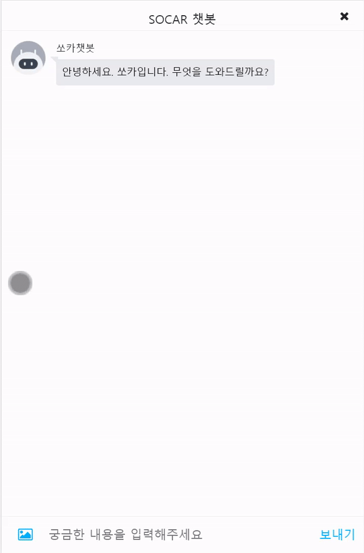
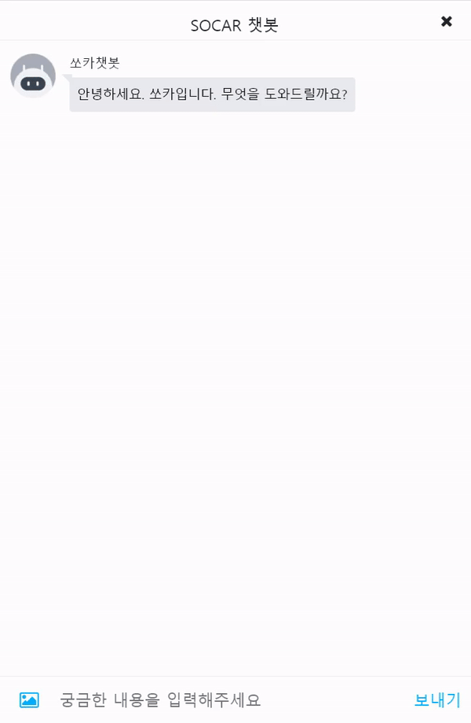

# 생성형 멀티 모달 SOCAR 챗봇
  본 프로젝트는 모두의 연구소 AIFFEL 쏘카3기 프로젝트로 데이터 보안이 필요한 부분은 비식별 처리가 되어있습니다
  
## 프로젝트 목적
챗봇 시장규모가 커짐에 따라 검색 기반(시나리오) 베이스인 쏘카 챗봇으로는 고객 경험과 상담원 문제를 제고하기 쉽지 않음. 따라서 다음 조건을 만족하는 **생성 기반 챗봇**을 구현

- 고객 경험 증대 (익숙한 대화형, 만족도 증가)
- 다양한 상황에 대응 (생성 기반)
- 다양한 정보에 반응 (멀티 모달)
- 상담 업무의 효율화 (비용 절감)  

## 데이터
- 쏘카 정비메모 데이터
- 쏘카 홈페이지 FAQ
  
## 사용 모델
- KeyBERT
- KoBART
- KoDialoGPT
  
## 역할
- EDA
- KeyBERT로 키워드 추출
- KoBART로 비정제 데이터(단답형)을 정제(구어체)로 변경
- KoDidaloGPT 생성형 챗봇 적용
- 성능평가지표 적용(Perplexity, BLEU)
- 논문 읽고 적용

## 보완할 점
- 다양한 Task에 적용할 수 있도록 입력 문장 **분류 모델** 도입
- 챗봇에 음성을 추가한다면 상담원의 역할을 대부분 대체가능할 것으로 보인다. 따라서 멀티모달 챗봇으로써 음성을 추후에 추가
- 고객 경험을 제고를 위해 다양한 고객의 요구에 대응하는 챗봇으로 개선
  
## 프로젝트 기간
- 2022.12.26 ~ 2023.02.07
  
## 팀원
- [김종태](https://github.com/happybell80) - Frontend
- [황환용](https://github.com/hwangsae91) - MLOps, Infra
- [노현호](https://github.com/nhh2907) - NLP
- [박수진](https://github.com/darkhairlove) - NLP
- [김태종](https://github.com/xowhddk123) - CV

## 시연 영상
 